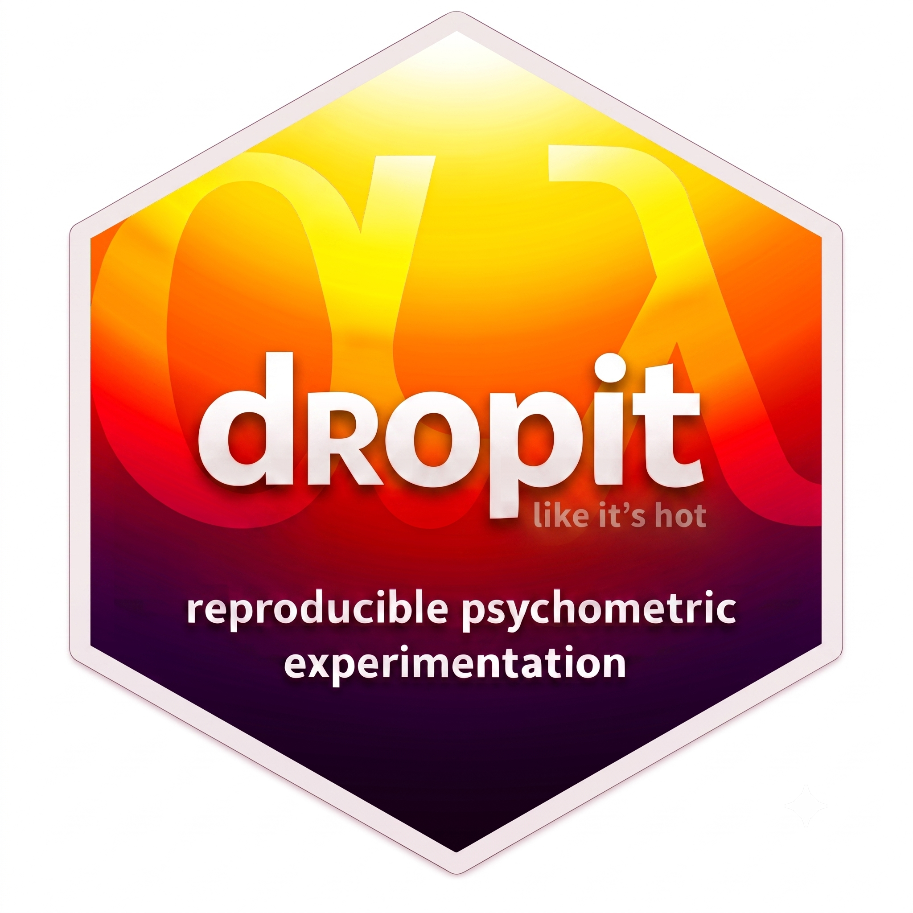

# dropit – R Tools for Reproducible Psychometric Experimentation 

## Description

The `dropit` package provides tools for reproducible psychometric
experiments. It is built to explore how structural modifications of an
item-based measurement instrument — or scale — affect different outcome
metrics.

The core function
[`dropit()`](https://sbissantz.github.io/dropit/reference/dropit.md)
scores items by Cronbach’s alpha (via `psych`) or by confirmatory factor
analysis (CFA) loadings (via `lavaan`), and drops the weakest or
strongest. Dropping runs in a single pass or greedily, refitting the
model after each round. Items can be organized into subscales and
dropped independently within each of them. Either way, important items
can be anchored so they are never dropped.

All procedures are fully traceable, with strict input validation,
detailed message handling, and informative console output to support
transparent and iterative research workflows.

## Installation

The `dropit` package is not available on CRAN — but you can install the
development version from GitHub.

``` r

# with pak (recommended)
install.packages("pak")
pak::pak("sbissantz/dropit")

# or with remotes
install.packages("remotes")
remotes::install_github("sbissantz/dropit")
```

## Quick Start

``` r

library(dropit)

# Drop the weakest item from the agreeableness scale based on CFA loadings
dropit(
  data = psych::bfi[, 1:5], 
  n_drop = 1, 
  direction = "tail",
  criterion = "lambda"
)
```

## Contributing

Contributions, suggestions, and bug reports are welcome. Please [open an
issue](https://github.com/sbissantz/dropit/issues) or submit a pull
request on GitHub.

## Generative AI Statement

We use generative AI to streamline and optimize this package.

Most importantly, we let it run regularly through the code base to catch
bugs or inconsistencies before they reach a release (with more or less
success, to be honest).

In addition, it helps us keep naming and coding conventions consistent,
so everything stays easy to follow and build on. Reliably, it tweaks our
vignettes, tunes the docs to match the code, and sharpens our error and
warning messages (in the hope of a better user experience). To our
astonishment and horror, it always finds typos, spots grammar issues,
and detects awkward phrasing that slips past us non-native speakers.

Beyond that, we use it extensively to improve the robustness of our
package. For instance, it assists us in extending our test suite and has
successfully hunted down multiple dirty little edge cases (we would
probably have missed). More than once, it has suggested structures that
we now find easier to test and maintain. Without complaining, it handles
all GitHub Actions chores, helping the package build on most systems and
stay backward compatible.

We invest a great deal of time reviewing, modifying, discussing, and
approving the suggestions. That said, if something gets past us, feel
free to [let us know](https://github.com/sbissantz/dropit/issues). In
any case, we take full responsibility for the final code and
documentation. Our tools are [Claude
Code](https://claude.com/claude-code), [GitHub
Copilot](https://github.com/features/copilot), and [DeepL
Write](https://www.deepl.com/write).
